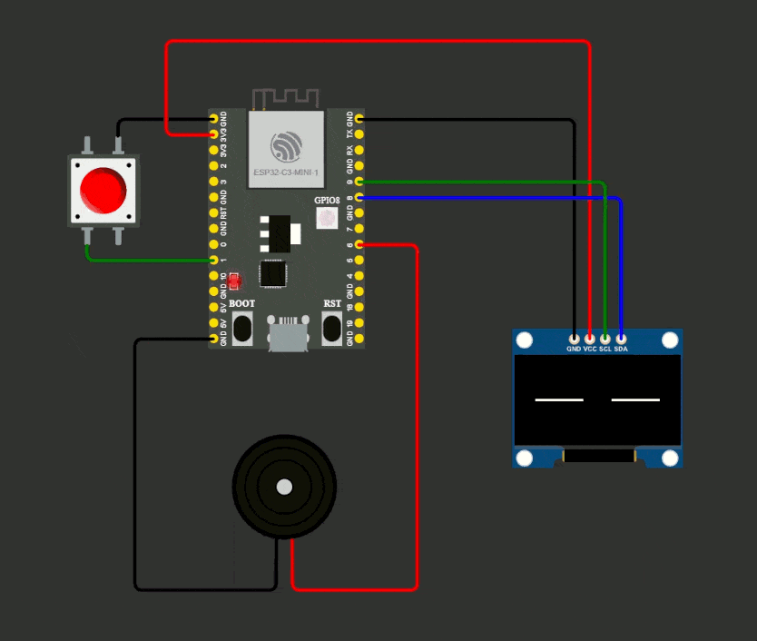

# Mochi ESP32 Client

  

This is the ESP32 client for the Mochi animatronics project. It brings
expressive robot eyes and quirky sounds to life, inspired by
[Huy Vector's video](https://www.youtube.com/watch?v=HIvB4Zc_rUo).
It optionally generates the emotions using GenAI (Gemini).

> **Inspired by:** [Huy Vector - Make a Robot Face with AI](https://www.youtube.com/watch?v=HIvB4Zc_rUo)

## Overview

The Mochi ESP32 client receives animation and sound data from a server and
displays them on an OLED screen, while playing matching sounds through a buzzer.
The server uses AI to generate unique facial expressions and robot voices, which
are sent to this device over WiFi.

- **Eyes Animation:** Smooth, expressive eye movements rendered on an SSD1306
  OLED display.
- **Sound Playback:** Short, quirky robot jingles played via PWM on a buzzer.
- **Touch Sensor:** Triggers a request to the server for new animation and
  sound.

## How It Works

1. **Server generates data:** The [Mochi server](https://github.com/dzonder/mochi-server)
   creates animation and sound data using AI.
2. **ESP32 receives data:** This client listens for POST requests at `/draw` (for
   eye animation) and `/play` (for sound).
3. **Touch to refresh:** Touching the sensor sends a GET request to the server,
   which triggers new data generation.
4. **Display and sound:** The ESP32 decodes the received data, animates the
   eyes, and plays the sound.

## Setup & Usage

1. **Hardware Required:**
   - ESP32 board
   - SSD1306 OLED display
   - Buzzer
   - Touch sensor
   - (Optional) Breadboard and jumper wires

2. **Software Requirements:**
   - VS Code (recommended)
   - PlatformIO (recommended)
   - Server running [dzonder/mochi-server](https://github.com/dzonder/mochi-server)
   - `config.h` setup:
      - Pin numbers set according to the hardware
      - WiFi credentials set
      - Target URL of the server set

3. **Build & Flash:**
   - Clone this repo
   - Configure your WiFi, pins and target in `src/config.h`
   - Build and upload using PlatformIO

4. **Run the Server:**
   - See [dzonder/mochi-server](https://github.com/dzonder/mochi-server) for setup instructions

5. **Demo:**
   - Power on the ESP32
   - Touch the sensor to trigger new animations and sounds
   - Watch the OLED display and listen to the buzzer